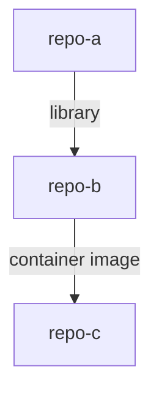

# Dependency Matrix Diagram

> Replace the placeholder nodes above with actual repos and dependencies discovered through audits.

## High-Risk Nodes

| Repo | Dependents | Risk |
|---|---|---|
| | | |
