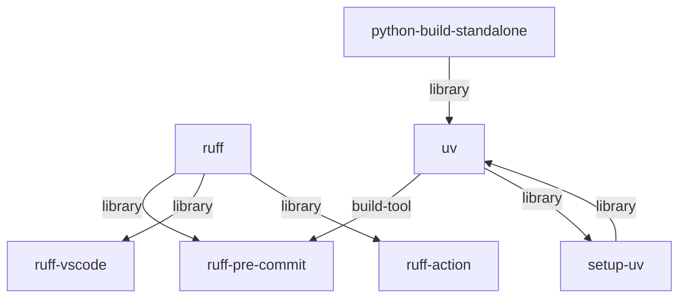

# Dependency Matrix Diagram

```mermaid
flowchart TD
    python_build_standalone["python-build-standalone"]
    ruff["ruff"]
    ruff_action["ruff-action"]
    ruff_pre_commit["ruff-pre-commit"]
    ruff_vscode["ruff-vscode"]
    setup_uv["setup-uv"]
    uv["uv"]
    ruff -->|"library"| ruff_pre_commit
    uv -->|"build-tool"| ruff_pre_commit
    ruff -->|"library"| ruff_vscode
    setup_uv -->|"library"| uv
    ruff -->|"library"| ruff_action
    uv -->|"library"| setup_uv
    python_build_standalone -->|"library"| uv
```

## High-Risk Nodes

| Repo | Dependents | Risk |
|---|---|---|
| ruff-pre-commit | ruff, uv | medium |
