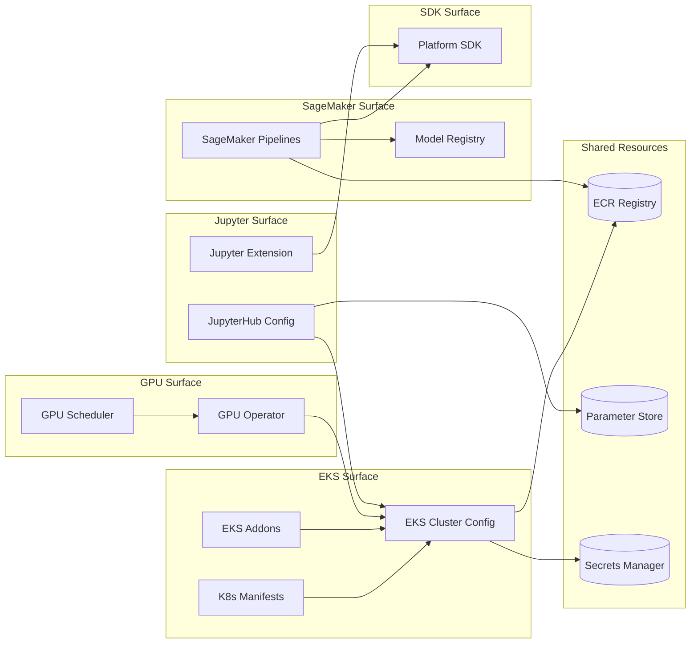

# Dependency Matrix Diagram

Visual rendering of the dependency relationships from [maps/dependency-matrix.md](../maps/dependency-matrix.md).

> Update this diagram as the dependency matrix evolves.

> Replace the example nodes and edges above with actual repos and dependencies discovered through audits.
