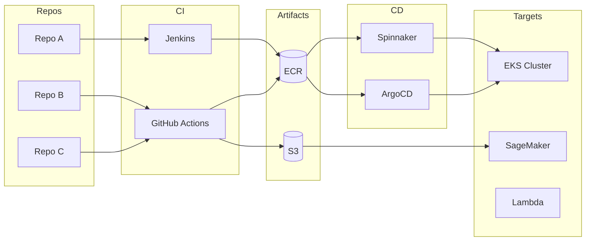
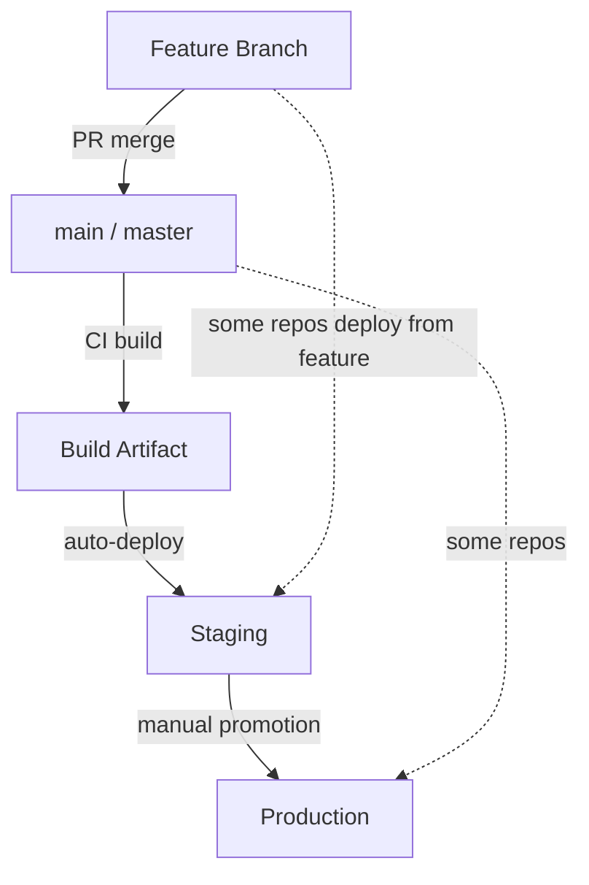

# Deployment Flow Diagram

Visual rendering of how code moves from repos to production, sourced from [maps/deployment-flow.md](../maps/deployment-flow.md).

> Update this diagram as deployment paths are discovered and documented.

> Replace the example paths above with actual deployment flows discovered through audits.

## Branch-to-Environment Flow

> Not all repos follow the same promotion model. Document exceptions in [maps/deployment-flow.md](../maps/deployment-flow.md).
