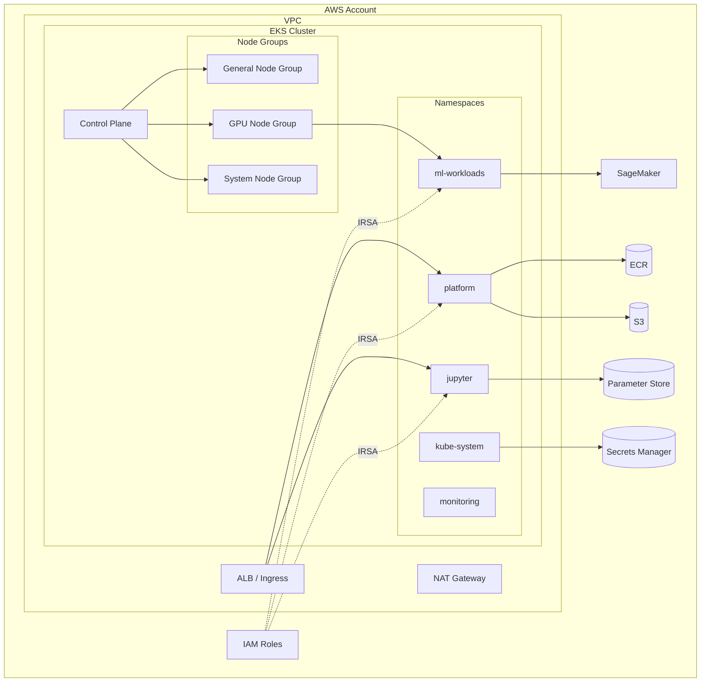

# EKS InfraStack Diagram

Architecture of the EKS infrastructure layer and its relationships.

> Update this diagram as EKS-related audits reveal the actual topology.

> Replace placeholder namespaces, node groups, and connections with actual infrastructure as discovered through audits.
