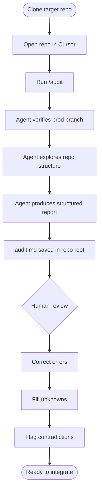
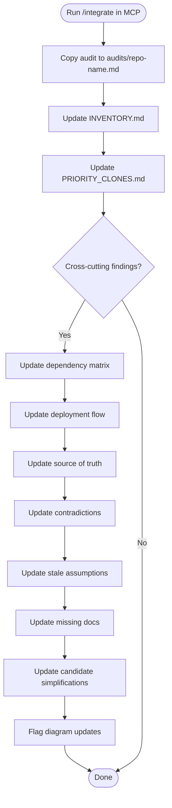
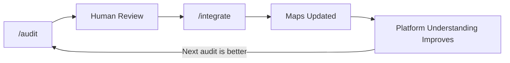

# Workflow: Audit and Integrate

Visual rendering of the two-phase workflow powered by the MCP skill.

## Phase 1: /audit

## Phase 2: /integrate {repo-name}

## The Compounding Loop

Each audit feeds the shared model. The shared model makes the next audit more effective. This is the core value loop of Master Control Protocol.
