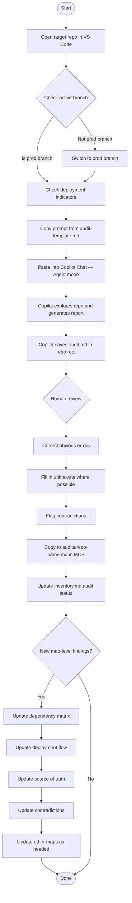
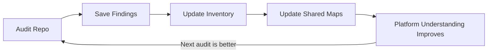

# Workflow: Running a Self-Audit on a New Repo

Visual rendering of the audit process described in [audit-template.md](../audit-template.md).

## The Compounding Loop

Each audit feeds the shared model. The shared model makes the next audit more effective. This is the core value loop of Master Control Protocol.
